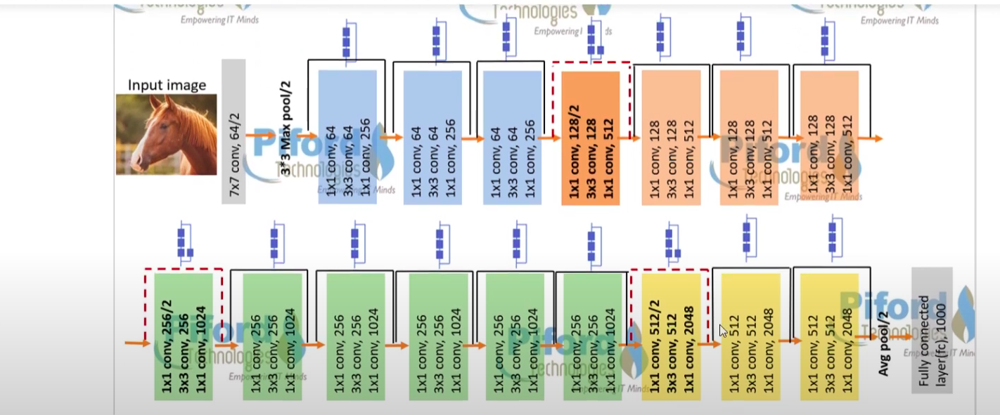

<h1style="background-color:green">  ResNet50  </h1>

* [Deep Residual Learning for Image Recognition 2015 Paper](https://arxiv.org/pdf/1512.03385.pdf)

# Residual Block

* In traditional neural networks, each layer feeds into next layer

In a network with `residual blocks`

* each layer feeds into next layer and directly into layers about 2–3 hops away this is all about residual concep

## Understanding intuition behind Residual Block:

1. Why Residual Block was required in first place?
2. Why it is so important?
3. How similar it looks to some other state-of-the-art architectures?

Lets answer above questions

There are many interpretation of `Why residual blocks are awesome` and `How & Why they are one of key ideas that can make a neural network show state-of-the-art performances on a wide range of tasks`

We know

* neural networks are Universal Function Approximators
* accuracy of NN increases with increasing number of layers

There is a limit to number of layers added that results in an accuracy improvement ` `

If neural networks were universal function approximators, then they should have been able to learn any simple or complex function ` `

Because of some problems like

*`Vanishing Gradients`

*`Curse of Dimensionality`

If we have sufficiently deep networks, it may not be able to learn simple functions like an identity function

1. If we keep increasing number of layers, we will see that `accuracy will saturate at one point and eventually degrade`

* This is usually not caused due to `overfitting`

2. It might seem that `shallower networks are learning better than their deeper counterparts`

* In practice this is what was observed and is popularly known as **Degradation Problem**

In **`Degradation Problem`** we know that shallower networks perform better than deeper counterparts with few more layers added to them ` `

So, why not skip these extra layers and at least match accuracy of shallow sub-networks

**`How possible one can skip layers from training?`**

Training of few layers can be skipped using `Skip Connections` or *`Residual Connections`*

This is what you will see in above image

* We can directly learn an `identity function` by relying on `skip connections only`
* This is exact reason why `skip connections are also called identity shortcut connections`

*`skip connections` or `identity shortcut connections` is One solution for all problems

**`Why we are calling Skip Connections also Residual Connections?`**

Lets answer

1.`Why call it Residual?`

2.`Where is Residue?`

Consider a neural network block with input as $x$` `

We would like to `learn true distribution` --> $f(x)$

Let us denote `Residual` or `difference` between this as:

$$
R(x) = output - input
$$

$$
R(x) = f(x) - x
$$

rearanging above equation:

$$
f(x) = R(x) + x
$$

$f(x)$ ==> True Output

$R(x)$ ==> Residual

Our `Residual Block is overall trying to learn true output` --> $f(x)$

Look closely at above image

* we have an identity connection coming as $x$
* layers are actually trying to learn `Residual` --> $R(x)$

**`Concluding:`**` `

* Layers in a traditional network are learning true output --> $f(x)$
* Layers in a Residual Network(ResNet) are learning residual --> $R(x)$, hence name : Residual Block

It is also Observed that:

* it is easier to learn residual of output and input, rather than only input
* in addition, network can now learn identity function by simply setting residual as zero

In backpropagation, problem of `Vanishing Gradient` arises with increasing number of layers

* because of these `skip connections` we can propagate larger gradients to initial layers
* these layers also could learn as fast as final layers which giving us `ability to train deeper networks`

Lets see **`How to arrange Residual Block and Identity Connections for optimal gradient flow`**

* It is Observed that `Pre-activations with Batch Normalizations generally give best results`
* see `right-most residual block in image`, this will gives most promising results

Above Image contain Types of Residual Block

**`BN`** => batch normalization

While training ResNets

* we either `train layers in residual blocks` or

*`Skip training for those layers using skip connections`

Different parts of networks will be trained at different rates for different training data points `based on how error flows backward in network`

This can be thought of as training an ensemble of different models on dataset and getting best possible accuracy

In general

* We do not know `optimal number of layers` (or residual blocks) required for a neural network which might depend on complexity of dataset
* Instead of treating `number of layers as an important hyperparameter to tune`
* by adding `skip connections to our network`, we are allowing network to skip training for layers that are
* not useful and
* do not add value in overall accuracy
* In a way, skip connections make our neural networks dynamic to tune number of layers during training optimally
* ResNet is an artificial neural network (ANN) of a kind that stacks residual blocks on top of each other to form a network
* Deep residual networks like `ResNet-50 model` is a kind of `CNN that is 50 layers deep`
* in 2015 ResNet was a solution to `vanishing gradient problem`
* ResNet incorporates identity shortcut connections which essentially skip the training of one or more layers — creating a residual block.

The authors then proposed an “optimized” residual block, adding an extension called a bottleneck. It would reduce the dimensionality in the first two CONV layers (1/4 of the filters learned in the final CONV layer) and then increase again during the final CONV layer. Here are two residual modules stacked on top of each other.

Finally a second paper on the residual module got published which was called **Identity Mapping in Deep Residual Networks** which provided an even better version of the residual block: the **pre-activation residual model** This allows the gradients to propagate through the shortcut connections to any of the earlier layers without any hindrance.

So instead of starting with a convolution (weight), we start with a series of (BN => RELU => CONV) * N layers (assuming bottleneck is being used). Then, the residual module outputs the addition operation that’s fed into the next residual module in the network (since residual modules are stacked on

## What is Deep Residual Learning used for?

ResNet was created with the aim of tackling this exact problem. Deep residual nets make use of residual blocks to improve the accuracy of the models. The concept of “skip connections,” which lies at the core of the residual blocks, is the strength of this type of neural network.

## ResNet-34 Architecture

The first ResNet architecture was the Resnet-34 which involved the insertion of shortcut connections in turning a plain network into its residual network counterpart. In this case, the plain network was inspired by VGG neural networks (VGG-16, VGG-19), with the convolutional networks having 3×3 filters. However, compared to VGGNets, ResNets have fewer filters and lower complexity. The 34-layer ResNet achieves a performance of 3.6 bn FLOPs, compared to 1.8bn FLOPs of smaller 18-layer ResNets.

It also followed two simple design rules –  the layers had the same number of filters for the same output feature map size, and the number of filters doubled in case the feature map size was halved in order to preserve the time complexity per layer. It consisted of 34 weighted layers.

The shortcut connections (Skip connections) were added to this plain network. While the input and output dimensions were the same, the identity shortcuts were directly used. With an increase in the dimensions, there were two options to be considered. The first was that the shortcut would still perform identity mapping while extra zero entries would be padded for increasing dimensions. The other option was to use the projection shortcut to match dimensions.

## Resnet-50 Architecture

While the Resnet50 architecture is based on the above model, there is one major difference. In this case, the building block was modified into a bottleneck design due to concerns over the time taken to train the layers. This used a stack of 3 layers instead of the earlier 2.

Therefore, each of the 2-layer blocks in Resnet34 was replaced with a 3-layer bottleneck block, forming the Resnet 50 architecture. This has much higher accuracy than the 34-layer ResNet model. The 50-layer ResNet achieves a performance of 3.8 bn FLOPS

## ResNet-101 and ResNet-152 Architecture

Large Residual Networks such as 101-layer ResNet101 or ResNet152 are constructed by using more 3-layer blocks. And even at increased network depth, the 152-layer ResNet has much lower complexity (at 11.3bn FLOPS) than VGG-16 or VGG-19 nets (15.3/19.6bn FLOPS
